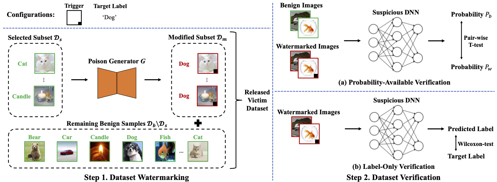

# Black-box Dataset Ownership Verification via Backdoor Watermarking

This is the official implementation of our paper [Black-box Dataset Ownership Verification via Backdoor Watermarking](https://doi.org/10.1109/TIFS.2023.3265535), accepted by IEEE Transactions on Information Forensics and Security (2023). This research project is developed based on Python 3 and Pytorch, created by [Yiming Li](http://liyiming.tech/) and [Mingyan Zhu](https://github.com/MingyanZHU).

## The Main Pipeline of Our Methods




## Requirements

To install requirements:

```python
pip install -r requirements.txt
```

## Running Examples

### For CV tasks

Please follow the instructions in [main.sh](CIFAR/main.sh). Before you run our codes, please make sure you have downloaded the [CIFAR-10](https://www.cs.toronto.edu/~kriz/cifar.html) or the [sub-imagenet-200](https://drive.google.com/drive/folders/1EB50v3vc4F48pgXOIkt_DymvSXwJU-Md) dataset and put it in the `./CIFAR/data` or `./Sub-ImageNet/data` directory. Besides, for convenience, we also provide the [checkpoints](https://drive.google.com/drive/folders/10euQffEjbXJVePJ0sK3ExOW1iuTbeZIo?usp=sharing) so that you can run the hypothesis-test directly.

For example, to train a watermarking ResNet-18 model on CIFAR-10 and test it, you can run the following command:

```python
# make sure you are in the CIFAR directory `./CIFAR`
# ResNet Standard Training
python3 train_standard.py --gpu-id 0 --checkpoint './checkpoint/benign/resnet'

# ResNet Backdoor watermarked training
python3 train_watermarked.py --gpu-id 0 --poison-rate 0.1 \
   --checkpoint 'checkpoint/infected/resnet_badnets_cross_0_010' \
   --trigger './triggers/Trigger_cross.png' --alpha './triggers/Alpha_cross.png' --y-target 0

# ResNet Backdoor watermarked testing
python3 Ttest.py --gpu-id 0 --model 'resnet' --trigger './triggers/Trigger_cross.png' --alpha './triggers/Alpha_cross.png' \
   --model-path './checkpoint/infected/resnet_badnets_cross_0_010/checkpoint.pth.tar' --target-label 0 --num-img 100
python3 Wtest.py --gpu-id 1 --model 'resnet' --trigger './triggers/Trigger_cross.png' --alpha './triggers/Alpha_cross.png' \
    --model-path './checkpoint/infected/resnet_badnets_cross_0_010/checkpoint.pth.tar' --target-label 0 --num-img 100

```

### For NLP tasks

We don't provide the codes for NLP tasks due to some copyright issues. In general, we built our codes based on ["A backdoor attack against lstm-based text classification systems"](https://arxiv.org/abs/1905.12457). 

If you are interested in these tasks, please contact the authors of the above paper via email.

### For GNN tasks

We don't provide the codes for GNN tasks also due to some copyright issues. In general, we built our codes based on ["Backdoor Attacks to Graph Neural Networks"](https://doi.org/10.1145/3450569.3463560). 

If you are interested in these tasks, please follow their [github repository](https://github.com/zaixizhang/graphbackdoor).

## License 

This project is licensed under the terms of the Apache License 2.0. See the LICENSE file for the full text.

## Acknowledgments
We built our code based on [BackdoorBox](https://github.com/THUYimingLi/BackdoorBox), [Open-sourced Dataset Protection](https://github.com/THUYimingLi/Open-sourced_Dataset_Protection), and ["Backdoor Attacks to Graph Neural Networks"](https://github.com/zaixizhang/graphbackdoor). We also thank the authors of ["A backdoor attack against lstm-based text classification systems"](https://arxiv.org/abs/1905.12457) for providig their codes. 

Thanks for their excellent works!

## Citation

If you use this work or any code from this repository in your research, please cite our paper:

```bibtex
@article{li2023DVBW,
  title={Black-box Dataset Ownership Verification via Backdoor Watermarking},
  author={Li, Yiming and Zhu, Mingyan and Yang, Xue and Jiang, Yong and Wei, Tao and Xia, Shu-Tao},
  journal={IEEE Transactions on Information Forensics and Security},
  volume = {18},
  pages = {2318--2332},
  year={2023},
  publisher={IEEE}
}
```
